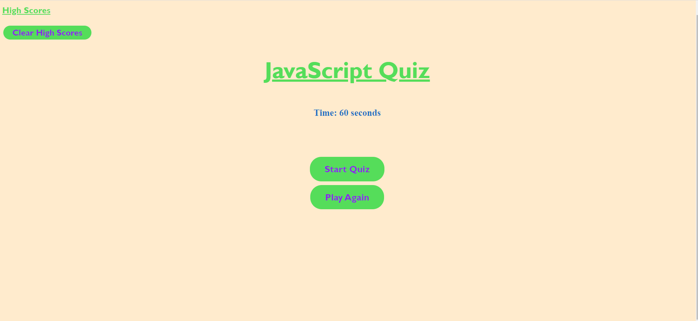
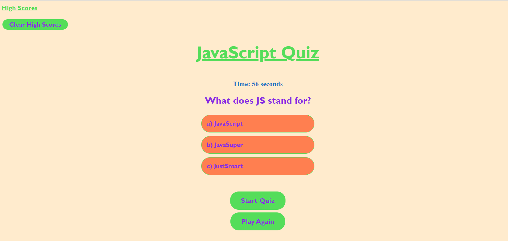
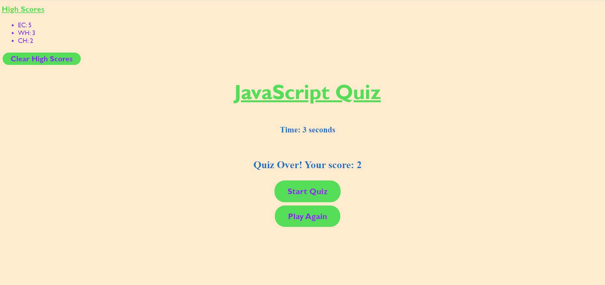

# JavaScript-Quiz

## Description

My goal for this project was to create a timed quiz on the subject of JavaScript. The quiz stores the scores for the users to compare while also providing the option the clear the scores. There is also a play again button to refresh the game. This project was extremely difficult in regards to the javascript... I was able to continue my much needed repetitive practice of creating and executing functions. I was also excited to play more with CSS and add some flare to the game :)

## Usage

To use this application the user will first click the start button which will generate 5 multiple choice questions for the user to answer. When they finish the game they will be prompted to enter their initials and add their score to the list of high scores. There is a button to clear all the scores if they chose and another button labeled "play again" that will refresh the game for another chance to play.

